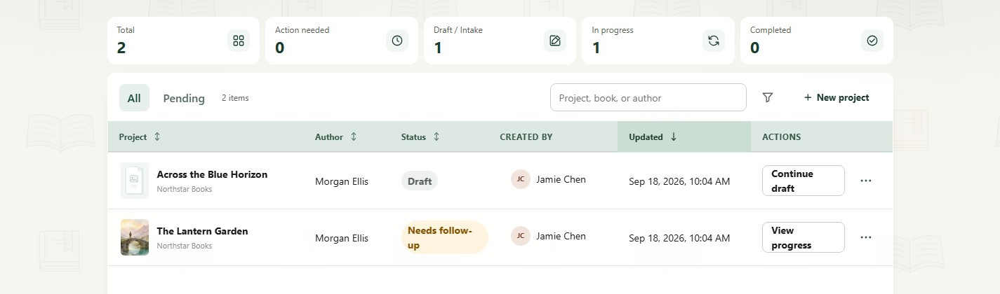
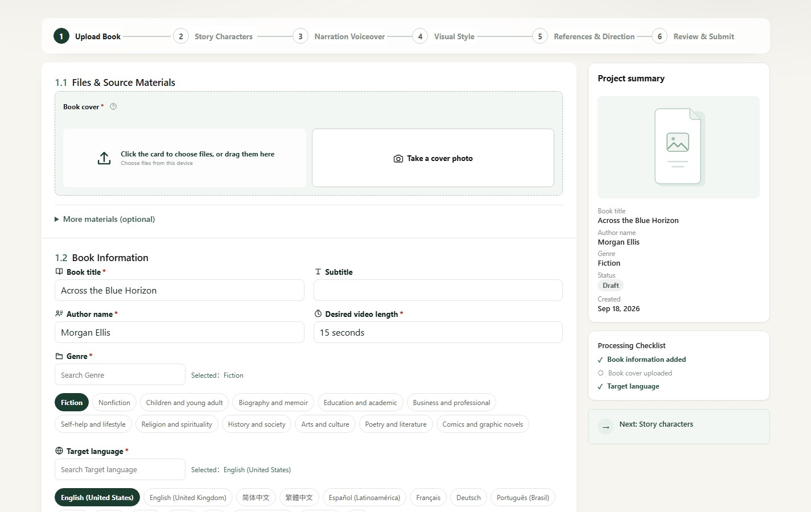
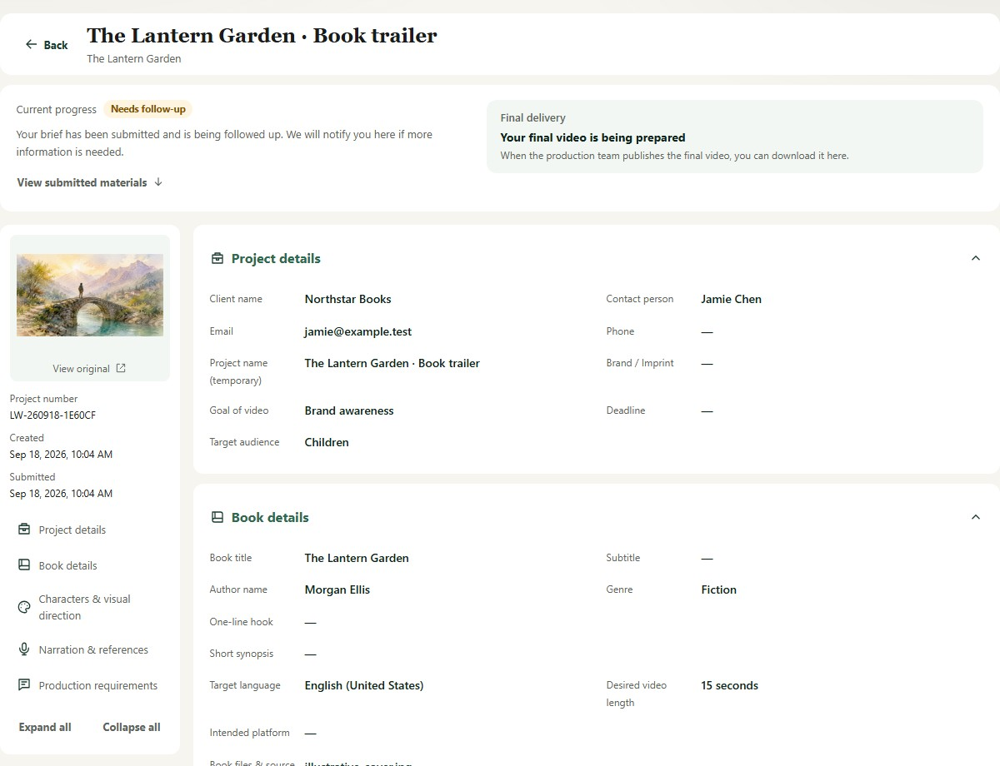
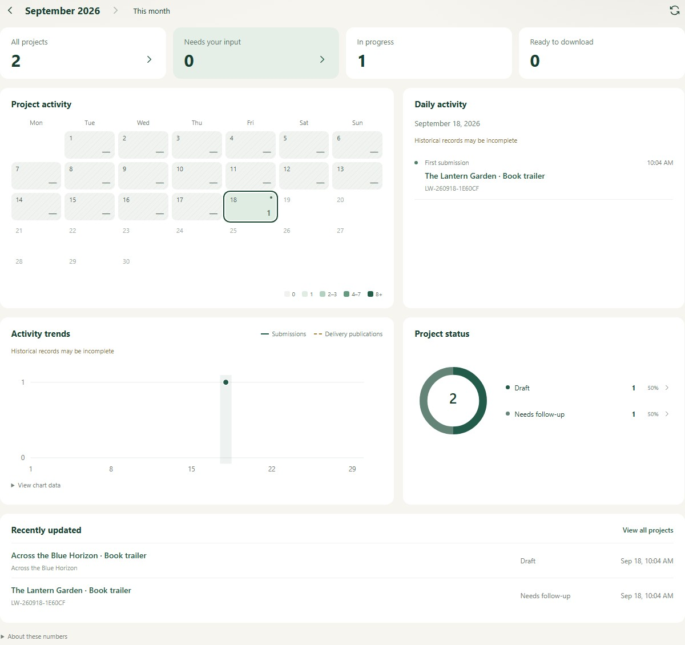
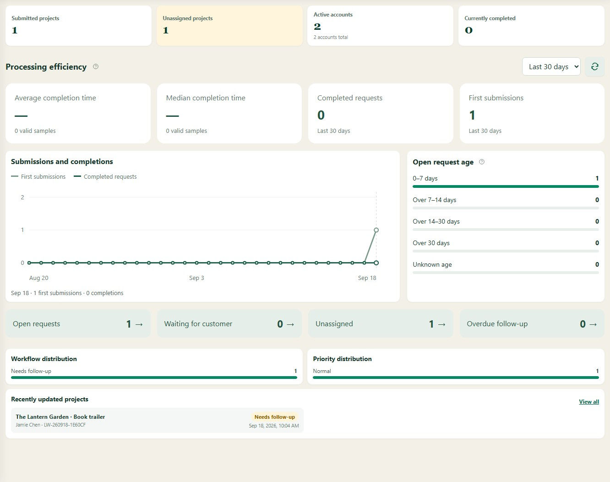

# Book Creative Portal

[中文](README.md) · [English](README.en.md) · [Documentation](docs/README.md) · [Acceptance checklist](docs/acceptance-meeting.md)

**Book Creative Portal**, developed by Lifewood, manages book-video project requirements, source materials, follow-up and final delivery. Customers submit and revise requested materials through a dedicated portal. Internal teams manage projects, organizations, accounts, notifications and platform feedback through the admin center. Lifewood is the company name; Book Creative Portal is the project name.

The current scope covers intake, manual follow-up and final-file delivery, with assisted book-information recognition. Video generation and a detailed production/review workflow are outside the current implementation.

The current version is [v0.3.18](docs/releases/v0.3.18.md). See [work status and pending decisions](docs/remaining-work.md) for implementation and acceptance boundaries.

## Screenshots

Captured from the running local application on September 17, 2026. These cropped views show local sample projects and exclude the account menu and contact details. Counts are local data, not production metrics. Both portals support Chinese and English; screenshots show Chinese.

### Customer portal

**Project list:** search and filter projects, check their status, resume drafts and view submitted-project progress.



**Project intake:** submit materials through a step-by-step form. This partial view of the book-upload step shows cover, book-file and supporting-material uploads alongside the project summary.



**Submission details:** current progress, delivery availability and grouped project information. The project-information section is collapsed to keep contact details out of the screenshot.



**Customer overview:** activity calendar, trends and project statuses. Dates reveal daily activity, and statuses link to filtered project lists.



### Admin center

**Overview:** average and median completion time, valid sample counts and open-request aging. Missing historical timestamps remain unknown rather than being inferred.



See the [screenshot notes](docs/images/screenshots/README.md) for capture scope and update instructions.

## Capabilities

| Area | Available functionality |
| --- | --- |
| Customer projects | Step-by-step intake, autosaved drafts, attachments, validation and idempotent submission |
| Follow-up and delivery | Assigned owners, priorities, internal notes, targeted returns, resubmission and final-file downloads |
| Organizations | Customers can browse their own organization’s members and open read-only profiles with activity calendars, sign-in summaries, request counts and searchable, paginated submission records; admins can expand member lists and create/add members with a prefilled organization |
| Analytics | Customer activity calendar and status drilldowns; admin completion duration, sample counts, 7/30/90-day trends and current workload |
| Communication | In-app notifications, announcements, platform feedback and notification-based replies |
| Identity and email | Account settings, email verification, password recovery, optional email reminders and multiple configurable OIDC providers |
| Administration | Permissions, audit records, configurable business options, backups, mail diagnostics and runtime settings |
| Outbound networking | Global HTTP/HTTPS proxy settings with per-AI/OIDC overrides; SMTP is separate |
| Interface | Chinese/English routes, responsive layouts, contextual help and reduced-motion-aware animations |

Completion duration is elapsed time from first submission to the first recorded manual completion, including waiting and customer revisions. It is admin-only and does not measure production labor or customer acceptance. Reliable timestamps are required for duration samples.

## Local development on Windows

Requires Node.js 22+ and the .NET 10 SDK. From the repository root:

```powershell
npm install
npm run start:local
```

Alternatively, after installing dependencies, double-click `start-local.bat`.

| Service | Default local URL |
| --- | --- |
| Customer portal | `http://127.0.0.1:5173/en-US/tasks` |
| Admin center | `http://127.0.0.1:5174/en-US/projects` |
| API | `http://127.0.0.1:5077` |

The account's language preference may redirect locale routes. Logs are written to `artifacts/dev-logs/`. Stop development services with `npm run stop:local` or `stop-local.bat`.

There are **no default credentials**. Create the first owner account from the server's loopback interface. For a headless server, use an SSH local port forward; see [deployment and backup](docs/deployment-and-backup.md).

## Architecture and repository

React 19, TypeScript, Vite and i18next power the two interfaces. The backend uses .NET 10, ASP.NET Core Minimal API, SQLite and explicit SQL. Production Native AOT packages serve the customer portal (`/`), admin center (`/admin/`) and API (`/api/`) from one process; Node.js and Vite are not required in production.

```text
apps/task-entry-web/          Customer portal
apps/admin-web/               Admin center
packages/                    Shared UI, types, API client and i18n
services/platform-api/       Backend and persistence
services/platform-api.Tests/ Backend tests
scripts/                     Development, validation, backup and release tools
docs/                        Product scope, operations, acceptance and screenshots
```

## Validation and packaging

```powershell
npm run verify        # Frontend/backend tests, operations checks and both web builds
npm run test:e2e      # Browser end-to-end checks
npm run build:release # Windows x64 self-contained archive
npm run build:msi     # Windows installer
```

For Native AOT checks, use `npm run publish:aot` and `npm run smoke:aot`. On a build machine matching the target Linux architecture, run `npm ci` and `npm run build:linux`. Packaging prerequisites and platform checks are documented in [release readiness](docs/release-readiness.md).

Keep production data separate from application files. Default data locations are `C:\ProgramData\Lifewood\BookCreativePortal\data` on Windows MSI installations and `/var/lib/lifewood-book-portal` on Linux. Back up the database, files and protection keys; never commit them or SMTP/OIDC credentials. Follow the deployment guide for cross-machine restores and key handling.

## Remaining work

The in-app [help center](docs/help-center.md) includes bilingual customer and administrator guides, full-text search, FAQs and expandable example screenshots. Customer accounts can access customer documentation only.

- Business acceptance of intake, targeted returns, notifications and final delivery.
- Production HTTPS domain, real email-link flows, identity-provider integration and outbound-network acceptance.
- Target-server, physical-device, transfer, backup/restore and upgrade validation.
- Agreement on production stages, responsibilities, review/rework rules and customer acceptance before expanding workflow scope.

See [product scope](docs/scope-registration-platform.md), [remaining work](docs/remaining-work.md), [email](docs/email.md), [OIDC](docs/oidc.md) and [outbound proxy configuration](docs/outbound-proxy.md). Passing local checks does not imply business or production acceptance.
