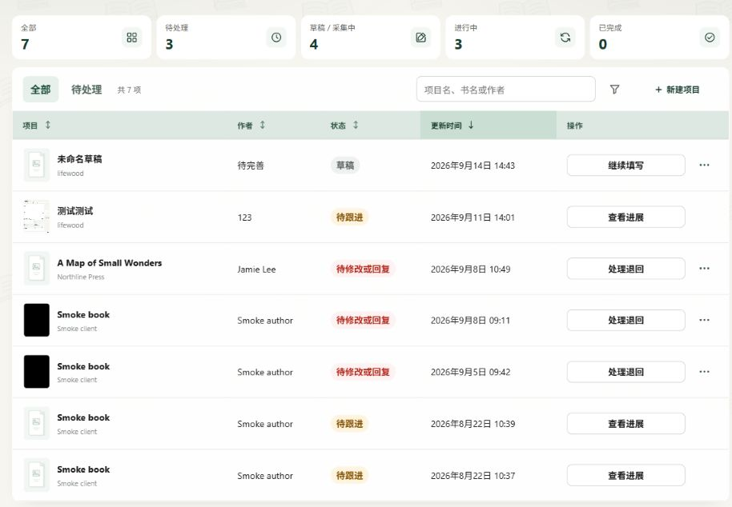
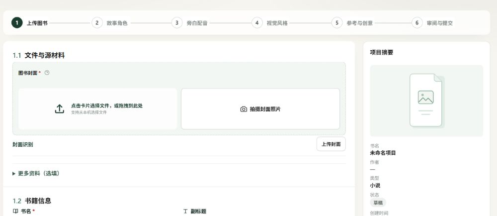
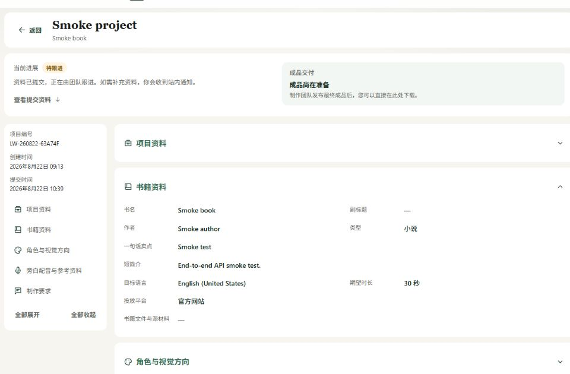
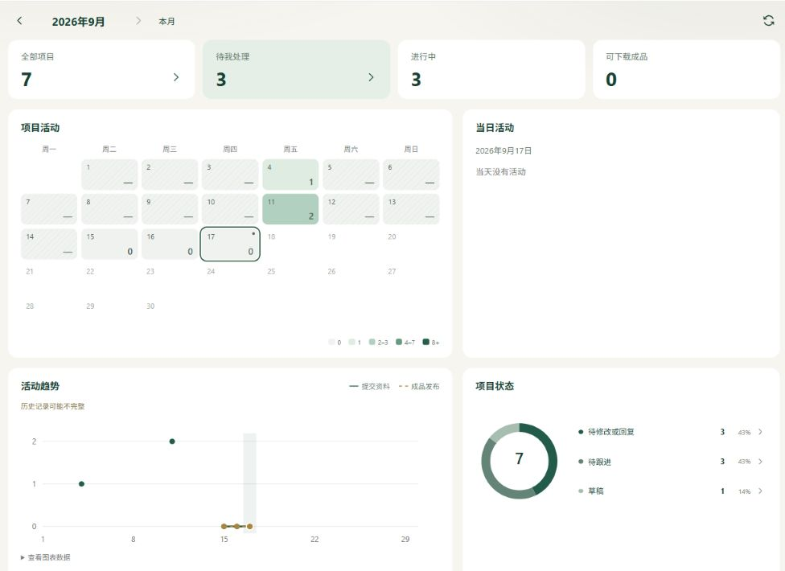
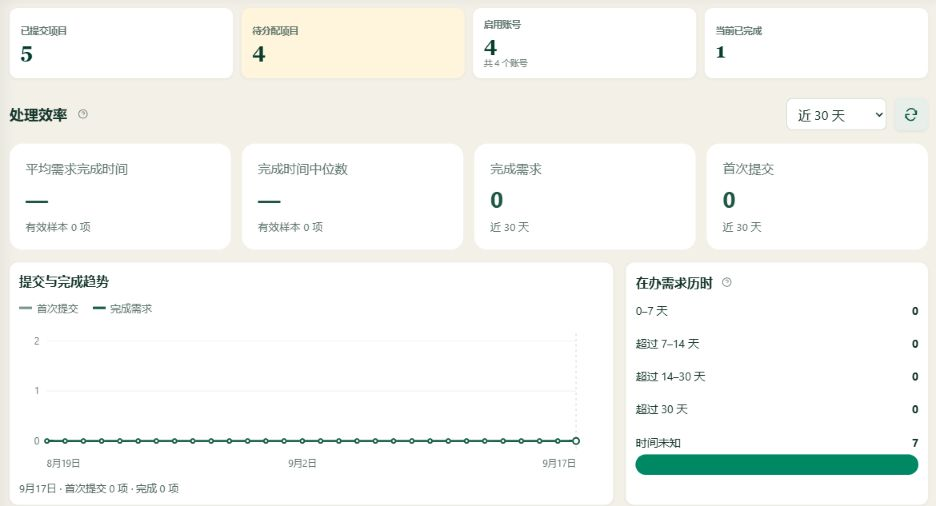

# Book Creative Portal

[中文](README.md) · [English](README.en.md) · [文档索引](docs/README.md) · [验收清单](docs/acceptance-meeting.md)

**Book Creative Portal** 是由 Lifewood 开发的书籍视频项目资料与交付管理平台。客户通过门户提交需求、上传素材、补充资料并下载成品；内部团队通过管理中心分配和跟进项目、管理账号与组织，并处理通知和平台反馈。Lifewood 是公司名称，项目名称为 Book Creative Portal。

平台目前覆盖需求登记、人工跟进与成品交付，支持书籍资料辅助识别；视频生产、生成和详细制作工作流尚未纳入当前实现。

当前版本为 [v0.3.20](docs/releases/v0.3.20.md)。功能范围和待验收事项见[剩余工作与待确认事项](docs/remaining-work.md)。

## 界面预览

以下为 2026-09-17 本地运行界面的局部截图，展示本地样例项目，避开账号菜单和联系方式。统计数值反映本地数据，不代表生产业务规模。两端均支持中英文，截图使用中文界面。

### 客户门户

**项目列表**：查看项目状态，搜索和筛选项目，继续填写草稿或查看已提交项目的进展。



**资料填写**：分步提交项目资料。以下为“上传图书”步骤的局部，包含封面、书籍文件、补充材料和项目摘要。



**提交详情**：查看当前进展、成品交付状态和分组资料。截图中的“项目资料”已收起，避免展示联系方式。



**客户数据概览**：活动日历、趋势、状态分布；选择日期查看当日活动，点击状态进入对应项目列表。



### 管理中心

**统计概览**：平均完成历时、中位数、有效样本与在办时长分布。历史时间不可靠时显示“—”或“时间未知”，不会补造统计数据。



截图范围及更新方式见[截图说明](docs/images/screenshots/README.md)。

## 当前工作区新增

| 模块 | 已实现能力 |
| --- | --- |
| 组织与成员 | 展开组织查看成员、头像、搜索与分页；创建或添加成员时预填组织 |
| 后台效率分析 | 7／30／90 天提交与完成趋势、平均值／中位数及样本数、在办历时、待办跳转 |
| 邮件服务 | 所有者配置 SMTP、加密保存凭据、模板预览、发送状态与诊断；接入仍需环境配置 |
| 出站代理 | 全局默认代理，AI／OIDC 可单独覆盖；SMTP 不使用此代理 |
| 使用体验 | 客户看板联动、资料分组、统一帮助问号与浮层动效、底部分页和窄屏适配 |

## 了解当前产品范围

当前版本包含客户门户、管理中心和完整服务端。一个生产进程同时托管两套网页、认证、业务接口、SQLite 数据库和本地文件存储。

客户门户支持：

- 使用真实账号登录，修改密码和头像
- 从账号资料预填组织、联系人、邮箱和电话，不覆盖已有草稿内容
- 创建、自动保存、恢复和删除项目草稿
- 分步填写书籍资料、故事角色、旁白配音、视觉风格、参考素材和创意方向；旁白可选，需要时才展开具体声音配置
- 上传书籍封面、书籍正文、角色参考图和其他真实文件
- 使用后台维护的双语业务选项、视觉示例和参考音色
- 校验并幂等提交项目资料包
- 查看提交记录、跟进状态和最终成品；定向退回后补充指定资料并重新提交
- 在“我的组织”查看当前组织成员的头像、姓名和角色，支持搜索与分页；点击成员头像或姓名进入只读资料页，查看活跃日历、登录概况、需求统计及可搜索分页的提交记录
- 使用账号语言偏好、快捷账号切换、站内通知和平台问题反馈
- 使用可配置的邮箱验证、找回密码、可选邮件提醒及多个 OIDC 登录服务；真实服务需另行配置和验收
- 在数据概览查看项目状态、活动日历、提交与发布趋势
- 通过 `/zh-CN/*` 和 `/en-US/*` 使用中文或英文界面

管理中心支持：

- 创建、编辑、启用、停用账号，以及按权限永久注销普通账号
- 管理组织，查看成员列表，为账号分配一个组织
- 维护双语业务选项、文件限制和参考音色
- 查询已正式提交及定向退回跟进中的项目，不读取客户从未提交的草稿
- 分配负责人，更新状态和优先级，记录内部备注
- 上传或撤回最终成品
- 查询管理员写操作的审计记录，管理公告、反馈及备份
- 使用运营工作台、批量处理和资料导出；运营角色仅处理分配给自己的项目
- 查看后台效率概览；完成历时按首次提交到首次记录的标记完成计算，包含等待与补资料时间，仅后台可见
- 按权限配置邮件、多个 OIDC 登录服务、AI 接入、出站代理和运行设置

当前版本不包含：

- AI 文案、图片、配音或视频生成
- 详细的内部制作节点和团队调度
- 在线脚本编辑、场景审阅或时间点评论
- 客户绕过定向退回自行修改或撤回已冻结的资料包
- 短信通知、支付或订阅

当前范围与验收优先级见[产品需求基线](docs/scope-registration-platform.md)。字段细节见[客户详细需求](docs/product-requirements.md)和[管理中心需求](docs/admin-center-requirements.md)。

会议准备见[验收清单与演示流程 / Acceptance checklist and demo guide](docs/acceptance-meeting.md)，包含中英文验收步骤、通过标准及待决事项；所有业务验收结论仍待实际会议填写。

## 查看系统架构

生产发布不需要 Node.js、Vite 或独立网页服务器。Native Ahead-of-Time（AOT）编译后的服务端直接提供客户门户、管理中心和 `/api` 路由。

```text
浏览器
├── /                 客户门户
├── /admin/           管理中心
└── /api/             同源业务接口
        │
        ▼
Lifewood.BookPortal.Server
├── ASP.NET Core Minimal API
├── SQLite
└── 数据目录：附件、成品、审计队列和数据保护密钥
```

主要技术：

- React 19、TypeScript、Vite 和 i18next
- C#、.NET 10 和 ASP.NET Core Minimal API
- Microsoft.Data.Sqlite 和显式 SQL
- Windows x64、Linux x64 与 Linux arm64 Native AOT 发布

架构约束和 AOT 开发规则见[技术架构](docs/technical-architecture.md)。

## 在 Windows 启动开发环境

准备 Node.js 22 或更高版本和 .NET 10 SDK。首次使用先在仓库根目录运行 `npm install`，然后双击 `启动本地环境.bat`。脚本会启动完整服务端和两套 Vite 开发页面，并自动打开客户门户。

开发地址：

- 客户门户：`http://127.0.0.1:5173/zh-CN/tasks`
- 管理中心：`http://127.0.0.1:5174/zh-CN/projects`
- 服务端：`http://127.0.0.1:5077`

双击 `停止本地环境.bat` 停止本地进程。英文文件名脚本 `start-local.bat` 和 `stop-local.bat` 执行相同操作。

也可以在仓库根目录运行：

```powershell
npm install
npm run start:local
```

开发日志保存在 `artifacts/dev-logs/`。启动脚本检测到健康的现有进程时会复用服务；检测到失效记录时会清理记录并重新启动。

## 仓库结构

```text
apps/task-entry-web/    客户门户
apps/admin-web/         管理中心
packages/              共用 UI、领域类型、API 客户端和 i18n
services/platform-api/ .NET 服务端与数据访问
services/platform-api.Tests/ 服务端测试
scripts/               本地启动、验证、备份与发布脚本
docs/                  产品基线、专题说明、验收与截图
```

## 创建首个平台账号

新数据目录没有默认账号或密码。首次打开平台时，必须从服务端所在机器的回环地址创建负责人账号；远程客户端不能抢先完成初始化。

无桌面的 Linux 服务器不需要安装浏览器。通过 Secure Shell（SSH）端口转发，可以在自己电脑的浏览器里完成初始化：

1. 确保 Linux 服务器上的平台服务已经启动。以下示例假设服务监听 `5077` 端口。
2. 在**自己电脑的终端**中执行，将 `user@server` 替换为服务器的 SSH 用户名和地址：

```bash
ssh -N -L 127.0.0.1:15077:127.0.0.1:5077 user@server
```

3. 保持 SSH 连接，在**自己电脑的浏览器**打开 [http://127.0.0.1:15077](http://127.0.0.1:15077)，按页面提示创建首个负责人账号。
4. 创建完成后，在终端按 `Ctrl+C` 关闭隧道。之后通过已配置的站点地址正常登录。

访问路径为：自己的浏览器 → SSH 加密隧道 → Linux 服务器的 `127.0.0.1:5077`。平台收到的是服务器回环地址发起的连接，因此符合首次建号的本机访问要求。

`15077` 是自己电脑临时使用的端口；若被占用，可以换成其他空闲端口，并同步修改浏览器地址。末尾的 `5077` 是服务器上平台实际监听的端口，使用自定义端口时需要替换。`-N` 表示只建立隧道、不打开远程命令行，连接后终端保持等待是正常现象。

初始化后，服务端可以直接提供远程 HTTP，也可以通过 Kestrel 证书端点或反向代理提供 HTTPS；公网使用仍建议启用 HTTPS。具体步骤见[正式部署与数据备份](docs/deployment-and-backup.md)。

## 验证代码

运行前端测试、服务端测试和两套前端生产构建：

```powershell
npm run verify
```

生成并启动 Windows x64 Native AOT 产物：

```powershell
npm run publish:aot
npm run smoke:aot
```

运行浏览器端到端测试：

```powershell
npm run test:e2e
```

发布前还需要完成目标 Linux 架构的构建和运行验证。完整清单见[验证并发布平台](docs/release-readiness.md)。

## 生成发布包

生成 Windows x64 自包含压缩包：

```powershell
npm run build:release
```

生成 Windows Installer（MSI）安装包：

```powershell
npm run build:msi
```

在目标 Linux 架构的构建机生成自包含发布包：

```bash
npm ci
npm run build:linux
```

Windows MSI 默认将生产数据保存到 `C:\ProgramData\Lifewood\BookCreativePortal\data`。Linux 默认使用 `/var/lib/lifewood-book-portal`。覆盖安装和程序升级不会删除数据库、附件、最终成品或数据保护密钥。

## 处理生产数据

生产数据独立于程序目录。升级前执行备份并定期完成恢复演练；不要把数据库、上传文件或密钥复制进源码和发布包。

Windows 可以使用：

- `backup-platform.bat`
- `restore-platform.bat`

跨机器恢复前，请按[部署与备份说明](docs/deployment-and-backup.md)核对数据保护密钥、操作系统绑定与文件权限。密钥还关联加密保存的接入凭据，不应将删除密钥作为通用恢复步骤。

## 阅读项目文档

- [文档索引](docs/README.md)：本地启动、设计资料和开发基线
- [产品需求基线](docs/scope-registration-platform.md)：当前范围、角色、流程、配置、交付和验收标准
- [客户详细需求](docs/product-requirements.md)：客户流程、字段和历史决策细节
- [管理中心需求](docs/admin-center-requirements.md)：账号、组织、项目跟进和系统配置
- [UI 设计规范](docs/ui-design-specification.md)：紧凑布局、品牌样式、响应式和国际化
- [技术架构](docs/technical-architecture.md)：服务边界、Native AOT 和数据访问规则
- [帮助中心](docs/help-center.md)：客户/管理双语文档、搜索、截图与维护方式
- [正式部署与数据备份](docs/deployment-and-backup.md)：安装、首次设置、升级、备份和恢复
- [发布就绪检查](docs/release-readiness.md)：自动化验证和上线前人工检查
- [邮件服务](docs/email.md)／[OIDC 登录](docs/oidc.md)／[出站代理](docs/outbound-proxy.md)：可选外部服务的配置与验收边界
- [剩余工作](docs/remaining-work.md)：已完成改动、可推进事项与待确认条件

需求原图保存在 `需求图片/`。这些图片同时包含当前登记范围和远期制作流程；实施范围以产品需求文档中的已确认决策为准。

## 后续工作与待确认

后续重点是业务验收和实际部署环境验证：

- 开会验收现有登记、退回补充、通知及成品交付流程，记录通过标准和业务结论。
- 确定正式 HTTPS 域名，验收生产邮件链接、真实 OIDC 身份服务及出站网络。
- 在目标服务器、真实手机与实际网络下验证上传下载、备份恢复和升级。
- 在开发制作工作流前确认节点、角色权限、审阅与返工规则，以及客户“验收完成”的定义。
- 确认正式项目名、负责人联系方式展示和授权材料等仍未定稿的业务规则。

详细状态以[剩余工作](docs/remaining-work.md)和[原始需求图片核对](docs/requirements-image-audit-2026-09-14.md)为准；本地测试通过不等同于业务或生产验收通过。
