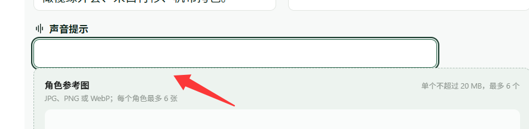

# 问题记录

## BUG-20260903-01：故事角色页字段与上传区域间距不足

- 状态：2026-09-04 已修复；窄屏视觉回归待补充。
- 发现日期：2026-09-03。
- 页面：客户门户 → 故事角色，路由 `/:locale/tasks/:taskId/edit/characters`。
- 现象：用户截图中，“声音提示”输入框下边缘紧贴“角色参考图”上传区域，聚焦描边与上传区域上边界出现视觉重叠。
- 根因：角色字段网格与紧随其后的参考图上传区域之间缺少外边距。
- 修复：为这两个相邻区域增加 1rem 间距，同时覆盖上传不可用时的替代区域。
- 预期：输入框与上传区域之间保留统一间距，聚焦描边完整可见、互不重叠。
- 验证：桌面中文、英文页面均实测间距 16px，聚焦截图确认描边不再与上传区域重叠；窄屏视觉回归待补充。
- 证据：下图为用户最初报告时的截图。

